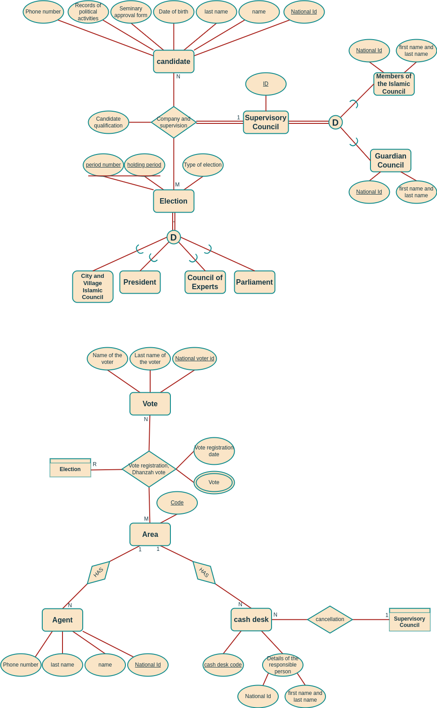
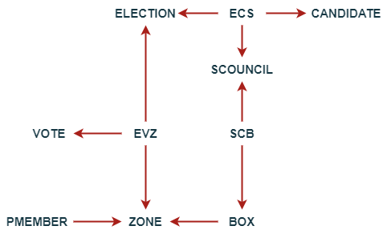
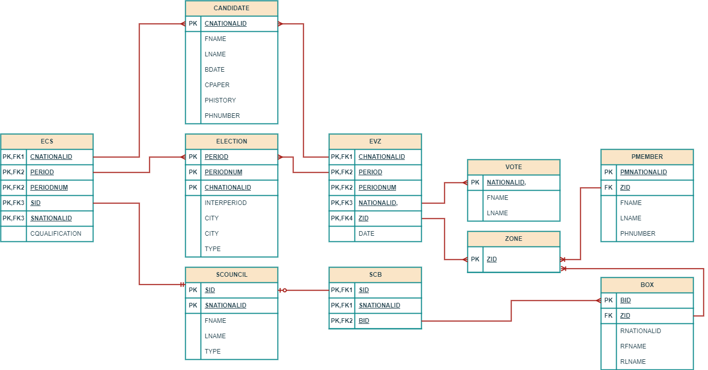

# Online Election Database Project

## Table of Contents
- [Project Description](#project-description)
- [Features](#features)
- [Project Structure](#project-structure)
- [Work Steps and Details](#work-steps-and-details)
  - [1. ER Diagram](#1-er-diagram)
  - [2. Internal Level Design](#2-internal-level-design)
  - [3. External Level Design](#3-external-level-design)
  - [4. SQL Implementation](#4-sql-implementation)
- [Getting Started](#getting-started)
  - [Prerequisites](#prerequisites)
  - [Installation](#installation)
  - [Usage](#usage)

## Project Description
The project implements the database of an online election website. This system manages different types of elections, including presidential elections, elections for the Islamic Council, the Assembly of Experts, and the Islamic City and Village Councils. The project includes candidate registration, qualification checks, public availability of candidate lists, the voting process, and handling of election cycles and by-elections.

## Features
- **Candidate Registration:** Individuals can register for candidacy by providing necessary documents and records of their political activities.
- **Qualification Verification:** Judges verify the qualifications of candidates for each election. The Guardian Council is responsible for presidential and Assembly of Experts elections, while the Islamic Council handles city and village council elections.
- **Election Cycles:** Each election type has specific cycles (e.g., presidential elections every 4 years).
- **Public Voting:** Qualified candidates are listed for public voting. Each district has a set number of representatives determined by voter turnout.
- **By-Elections:** Held if no representatives are elected or seats become vacant due to disqualification, resignation, death, etc.

## Project Structure
1. **ER Diagram:** Visual representation of the database schema.
2. **Internal Level Design:** Implementation details, including tables, relationships, and constraints.
3. **External Level Design:** User interfaces and interactions.
4. **SQL Implementation:** Scripts to create and manage the database.

## Work Steps and Details
### 1. ER Diagram
The ER diagram provides a comprehensive overview of the database structure, including entities, relationships, and attributes. Below is an image of the ER diagram:



### 2. Internal Level Design
The internal level design defines the logical structure of the database, focusing on tables, primary keys, foreign keys, and relationships. Key components include:
- **Candidates:** Stores candidate details and documents.
- **Judges:** Manages judges responsible for candidate qualification.
- **Elections:** Contains election details, cycles, and periods.
- **Votes:** Records votes cast by users.
- **Districts:** Defines districts and their respective candidates and representatives.

### 3. External Level Design
The external level design outlines how users interact with the system. Key user interfaces include:
- **Candidate Registration Form**
- **Judge Qualification Panel**
- **Voter Interface**
- **Election Results Dashboard**





### 4. SQL Implementation
The SQL scripts implement the database schema, including table creation, data insertion, and query operations. Key scripts include:
- `create_table.sql`: Script to create all necessary tables.
- `insert.sql`: Script to insert initial data into tables.
- `create_index.sql`: Script to create indexes for optimizing queries.
- `create_trigger.sql`: Script to create triggers for automatic actions.
- `create_view.sql`: Script to create views for simplified data access.

## Getting Started
### Prerequisites
- Database management system (e.g., MySQL, PostgreSQL)
- SQL client tool (e.g., MySQL Workbench, pgAdmin)

### Installation
1. Clone the repository:
    ```bash
    git clone https://github.com/Kiana8181/Online-Election-Database.git
    cd online-election-database
    ```
2. Create the database:
    ```sql
    CREATE DATABASE election_db;
    ```
3. Execute the SQL scripts in the following order:
    ```sql
    source sql/create_table.sql;
    source sql/insert.sql;
    source sql/create_index.sql;
    source sql/create_trigger.sql;
    source sql/create_view.sql;
    ```

### Usage
1. Open the SQL client tool and connect to `election_db`.
2. Execute queries from `queries.sql` to interact with the database.
